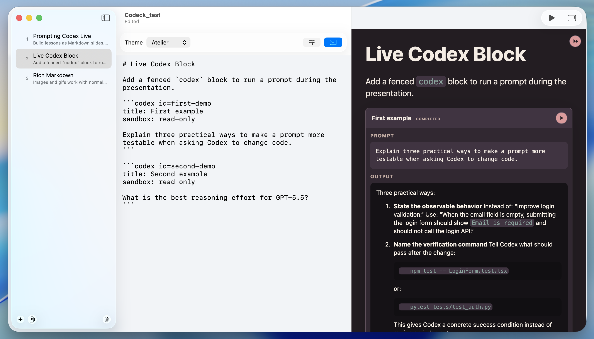

# Codeck



Codeck is a native macOS document-based Markdown presentation maker for teaching Codex prompting workflows.

## Document format

Documents use the `.mdeck` extension so macOS can associate them with Codeck
instead of the system Markdown editor. The body remains Markdown. Slides are
separated by a line containing only:

```markdown
---
```

Deck-level settings live in YAML front matter:

```markdown
---
format: codeck.mdeck
version: 1
theme: studio
codex:
  sandbox: read-only
  model: "gpt-5.5"
  reasoning: medium
---

# First Slide
```

Supported deck metadata:

- `format`: should be `codeck.mdeck`.
- `version`: current document version is `1`.
- `theme`: presentation theme. Supported values are `studio`, `midnight`,
  `chalk`, `solar`, and `atelier`.
- `codex.sandbox`: default sandbox for live Codex sessions. Defaults to
  `read-only`.
- `codex.model`: default model for live Codex sessions. Codeck fetches the
  available model list from `codex app-server` and falls back to `gpt-5.5` if
  Codex is unavailable.
- `codex.reasoning` or `codex.reasoning_effort`: default reasoning effort.
  Codeck fetches the supported values for the selected model from Codex and
  falls back to `low`, `medium`, `high`, and `xhigh`. Defaults to `medium`.

## Live Codex sessions

Add a fenced `codex` block to a slide:

````markdown
```codex id=refactor-demo
title: Explain the refactor goal
model: gpt-5.5
reasoning: xhigh
sandbox: read-only

Explain how to refactor this SwiftUI view into smaller subviews.
```
````

Deck defaults for model, reasoning, and sandbox are applied to every Codex
block. Any block can override those values with its own metadata.
Live sessions run through `codex app-server --listen stdio://`, so Codeck needs
the Codex CLI available on `PATH` and an active Codex login.

Supported block metadata:

- `id`: stable session id used for output tracking and slide buttons. It can be
  written on the opening fence, as shown above, or as a metadata line.
- `title`: display title for the live Codex card. This should describe what the
  prompt is meant to demonstrate.
- `model`: per-block model override.
- `reasoning` or `reasoning_effort`: per-block reasoning override. Supported
  values come from the selected Codex model.
- `sandbox`: per-block sandbox override. Common values are `read-only`,
  `workspace-write`, and `danger-full-access`.

Codeck always shows the Markdown response from Codex. While a session is running
and before the first response token arrives, the output area shows `Thinking...`.

The prompt starts after the first blank line following the metadata.

Each live Codex card has its own run button on the slide. When a slide contains
multiple Codex sessions, a slide-level run-all button appears in the top-right
corner. Codex responses stream into the slide live and are rendered as Markdown,
so lists, headings, tables, code, links, and images in the response use the same
renderer as the rest of the deck.

## Presenting

Press the toolbar play button to start a full-screen presentation from the
selected slide. Use the left and right arrow keys to navigate and Escape to exit.

## Local run loop

Use the project run script:

```bash
./script/build_and_run.sh
```

The Codex app Run button is wired to the same script through `.codex/environments/environment.toml`.
